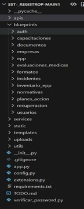
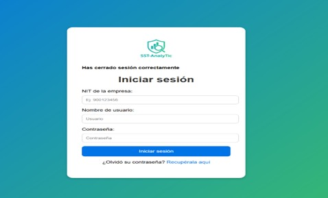
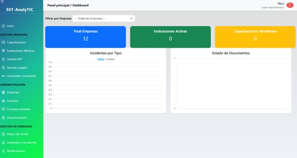
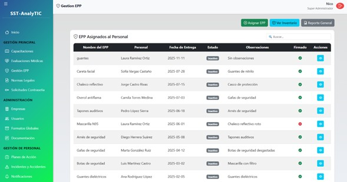
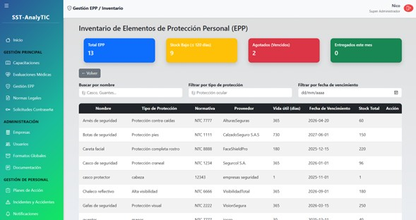
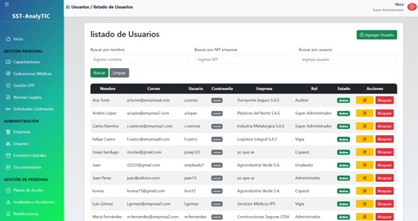

# SST ANALYTIC

**ANALYTIC** es una proyecto diseñado para facilitar la Gestión de Seguridad y Salud en el Trabajo (SST) en microempresas, permitiendo un control eficiente, simplificado y centralizado de procesos clave como entrega de EPP, gestión de usuarios, reportes y cumplimiento normativo.

## Caracteristicas

**Funcionalidades Principales de ANALYTIC**
ANALYTIC integra un conjunto robusto de módulos diseñados para cubrir las necesidades esenciales de Seguridad y Salud en el Trabajo (SST) en microempresas. El sistema permite administrar información, procesos y documentación de manera centralizada, asegurando orden, cumplimiento normativo y eficiencia operativa.

Módulo de Inicio (Dashboard)

•	Vista general del estado del sistema y accesos rápidos a los módulos principales.
•	Indicadores clave de SST.

Gestión Principal
Capacitaciones

•	Registro, seguimiento y evidencia de capacitaciones internas y externas.
Evaluaciones Médicas
•	Control del estado médico laboral de cada trabajador.
Gestión de EPP
•	Gestión de entrega, devolución y control de elementos de protección personal.
Normas Legales
•	Repositorio de normas SST aplicables a la empresa.
Solicitudes de Contraseña
•	Recuperación y administración de solicitudes de cambio de contraseña.

Administración
Empresas

•	Registro y gestión de microempresas afiliadas al sistema.
Usuarios

•	Control de usuarios, roles y permisos.
Formatos Globales

•	Plantillas y formatos estandarizados para uso general.
Documentación
•	Repositorio global de documentos institucionales.

Gestión de Personal
Planes de Acción

•	Creación, asignación, seguimiento y cierre de planes de acción.
Incidentes y Accidentes
•	Registro, análisis y trazabilidad de incidentes y accidentes laborales.
Notificaciones
•	Alertas automatizadas y comunicaciones internas del sistema.

## TEcnologias Utilizadas

ANALYTIC se desarrolla a partir de un ecosistema tecnológico moderno que permite construir una plataforma estable, eficiente y orientada a la gestión integral de SST en microempresas. Cada herramienta cumple un rol específico dentro del funcionamiento del sistema, garantizando una experiencia confiable tanto en el backend como en la interfaz del usuario.

Python

Lenguaje principal del backend.
Permite manejar la lógica del sistema, procesar información y gestionar peticiones del usuario. Su sintaxis clara y su ecosistema de librerías lo convierten en una opción ideal para aplicaciones empresariales.

Usos en el proyecto:
•	Procesamiento de datos
•	Conexión con la base de datos MySQL
•	Gestión de rutas y controladores
•	Lógica principal del sistema SST

Flask

Microframework de Python utilizado para construir el backend de forma modular y escalable.
Facilita la creación de rutas, la comunicación cliente-servidor y la integración con plantillas HTML mediante Jinja2.
Usos en el proyecto:
•	Construcción del servidor web
•	Gestión de sesiones y autenticación
•	Renderizado dinámico de vistas
•	Integración con MySQL

MySQL

Sistema de gestión de base de datos relacional utilizado para almacenar toda la información del sistema, como usuarios, empresas, EPP, capacitaciones, incidentes y más.
Usos en el proyecto:
•	Registro y consulta de datos empresariales y de SST
•	Relaciones entre trabajadores, módulos y documentos
•	Almacenamiento seguro y estructurado

XAMPP

Entorno local utilizado para el servidor MySQL y el manejo del entorno de pruebas durante el desarrollo.
Usos en el proyecto:
•	Administración del servidor MySQL
•	Entorno local para pruebas y desarrollo

HTML

Lenguaje base para la estructura de todas las vistas del sistema.
Define formularios, tablas, paneles y todos los elementos visibles para el usuario.
Usos en el proyecto:
•	Interfaz principal del usuario
•	Formatos, paneles y tablas
•	Estructura del frontend

JavaScript

Lenguaje utilizado en el frontend para darle dinamismo a las vistas.
Permite mejorar la interacción del usuario y la comunicación con el servidor.
Usos en el proyecto:
•	Validación en tiempo real
•	Funciones dinámicas en las páginas
•	Llamados asíncronos al servidor (fetch/AJAX)

Bootstrap

Framework de diseño que permite crear interfaces limpias, adaptables y organizadas.
Ofrece componentes prediseñados que facilitan la creación de un frontend profesional sin necesidad de escritura excesiva de CSS.
En ANALYTIC se usa para:
•	estilos responsivos,
•	grids y maquetación,
•	botones, tarjetas y alertas,
•	coherencia visual en todo el sistema.

## Instalacion y Ejecucion

A continuación se presentan los pasos esenciales para ejecutar el proyecto ANALYTIC en un entorno local.
Para instrucciones detalladas (con imágenes y procesos completos), consulte el Manual Técnico incluido en la documentación del proyecto.

Requisitos Previos
Antes de iniciar, asegúrate de contar con:
•	Python 3.10 o superior
•	XAMPP (servidor local para MySQL)
•	MySQL configurado en localhost (phpMyAdmin)
•	pip para instalar dependencias
•	Archivo de base de datos .sql incluido en el proyecto
1. Clonar o descargar el proyecto:
ej:
git clone https://github.com/tu-repo/analytic.git

O si lo prefiere descargar y descomprimir el ZIP.

2. Configurar el entorno virtual:
(Windows)
python -m venv venv
venv\Scripts\activate

3. Instalar dependencias necesarias:

pip install flask flask-moment flask-mail
pip install mysql.connector
pip install datetime

4. Configurar base de datos MySQL

-  Abrir XAMPP
-  Iniciar Apache y MySQL
-  Entrar a phpMyAdmin
-  Crear la base de datos
-  Importar el archivo .sql incluido en el proyecto
-  Verificar credenciales en tu archivo de configuración (ej: config.py)

5. Ejecutar el servidor Flask:
Dentro de la carpeta del proyecto:
python app.py
Una vez iniciado, accede desde tu navegador a:
http://127.0.0.1:5000

    
## Estructura

**Descripción general de la arquitectura**

•	blueprints/
Cada carpeta representa un módulo funcional (Usuarios, EPP, Empresas, Incidentes, etc.).
Contienen rutas, controladores y lógica independiente.

•	templates/
Vistas HTML clasificadas por módulo.

•	static/
Archivos estáticos: estilos, scripts y recursos visuales.

•	uploads/
Carpeta donde el sistema almacena archivos subidos por usuarios (documentos, evidencias, formatos).

•	services/
Código reutilizable para consultas, generación de reportes o lógica compleja.

•	utils/
Decoradores, validadores y otras funciones de apoyo.

## Roles y permisos

ANALYTIC implementa un sistema robusto de control de acceso basado en roles, diseñado para garantizar la seguridad de la información y mantener un flujo de trabajo organizado dentro de los módulos de Seguridad y Salud en el Trabajo (SST).
Cada rol tiene permisos específicos que determinan qué acciones puede realizar dentro del sistema.

1. Super Administrador

Máxima autoridad dentro del sistema.
Permisos:
•	Control total del aplicativo
•	Gestión de empresas y sus datos globales
•	Administración de usuarios y asignación de roles
•	Configuración general del sistema
•	Acceso a todos los módulos operativos (EPP, capacitaciones, incidentes, etc.)
•	Visualización y edición completa en todas las secciones
Ideal para: propietarios del sistema, administradores generales o consultores SST encargados de múltiples empresas.

2. Administrador

Encargado de la gestión operativa del sistema.
Permisos:
•	Gestión de capacitaciones
•	Evaluaciones médicas
•	EPP e inventarios
•	Planes de acción
•	Incidentes y accidentes
•	Normas legales
•	Documentación
•	Notificaciones
•	No administra empresas ni usuarios maestros
Ideal para: líderes de SST internos o responsables de la operación diaria.

3. Auditor

Rol orientado exclusivamente a revisión y control.
Permisos:
•	Acceso de solo lectura a la información del sistema
•	Puede revisar registros, documentos, EPP, incidentes, normativas y reportes
•	No puede crear, editar ni eliminar información
Ideal para: auditores internos, externos o entes de control que verifican el cumplimiento normativo.

4. Vigía

Responsable de apoyar la gestión SST en microempresas.
Permisos:
•	Registro y reporte de novedades
•	Consulta de documentos y normativas
•	Apoyo en el seguimiento de planes de acción
•	Revisión de incidentes y participación en su gestión
•	Acceso limitado según la operación diaria
Ideal para: empresas pequeñas donde existe un solo responsable de SST.

5. COPASST

(Comité Paritario de Seguridad y Salud en el Trabajo)
Permisos:
•	Consulta de información clave del sistema
•	Registro de observaciones
•	Participación en inspecciones, incidentes y acciones correctivas
•	Visualización de estadísticas e indicadores
•	Sin permisos administrativos ni de configuración
Ideal para: miembros del comité de vigilancia SST en empresas medianas o grandes.
Beneficios del sistema de roles:
•	Mayor seguridad de la información
•	Control preciso de accesos
•	Estructura clara para procesos SST
•	Responsabilidades bien delimitadas
•	Cumplimiento normativo garantizado

## Capturas Proyecto

Interfaz de acceso para todos los roles del sistema, con validación de credenciales y control de permisos.

Dashboard:
Vista general con indicadores rápidos, tarjetas informativas y accesos directos a los módulos principales.

Gestion EPP:
Incluye tablas, historial de entregas, inventario global y formulario para registrar asignaciones de equipos de protección personal.

Usuarios:
Permite gestionar roles, creación de cuentas, edición de información y estado de cada usuario.

Nota importante sobre los demás módulos
Para evitar redundancia y mantener el README ligero, no se incluyen capturas de cada uno de los 13 módulos.

Sin embargo, módulos como:

•	Capacitaciones
•	Evaluaciones Médicas
•	Normativas
•	Documentación
•	Inventario de EPP
•	Notificaciones
•	Recuperación de Contraseña
•	Empresas

Mantienen la misma estructura base, compuesta por:

•	Tabla principal de registros
•	Botones de acción (crear, editar, eliminar, descargar)
•	Formularios con diseño uniforme
•	Modales o páginas emergentes según el caso

Esta consistencia garantiza una curva de aprendizaje mínima y una navegación intuitiva para cualquier rol del sistema.

## Autores

El desarrollo de ANALYTIC fue realizado por un equipo multidisciplinario encargado del diseño, construcción y estructuración del aplicativo web orientado a la gestión de Seguridad y Salud en el Trabajo (SST) para microempresas.

**Luis Diaz - Frontend Developer**

**Anyi Beltran - Frontend Developer**

**Josep Berdugo - Backend Developer**

**Nicolas Gonzalez - Backend Developer**

Créditos
•	Desarrollo del frontend: interfaces, estructura visual y componentes modulares.

•	Desarrollo del backend: lógica del sistema, conexión con base de datos, rutas, control de permisos y ejecución del servidor.

•	Documentación técnica y funcional: colaboradores del equipo en conjunto.

